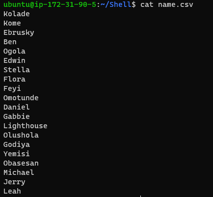
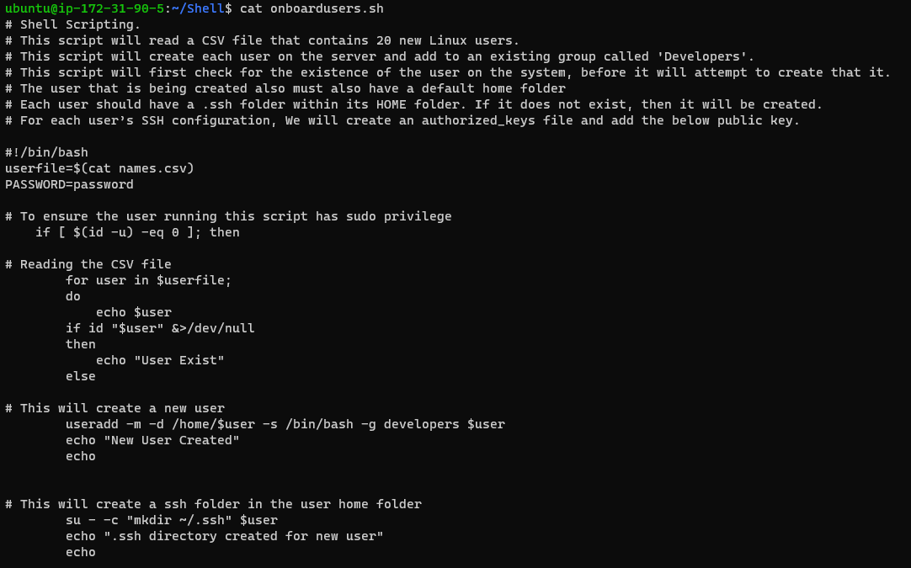
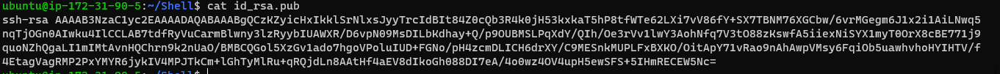
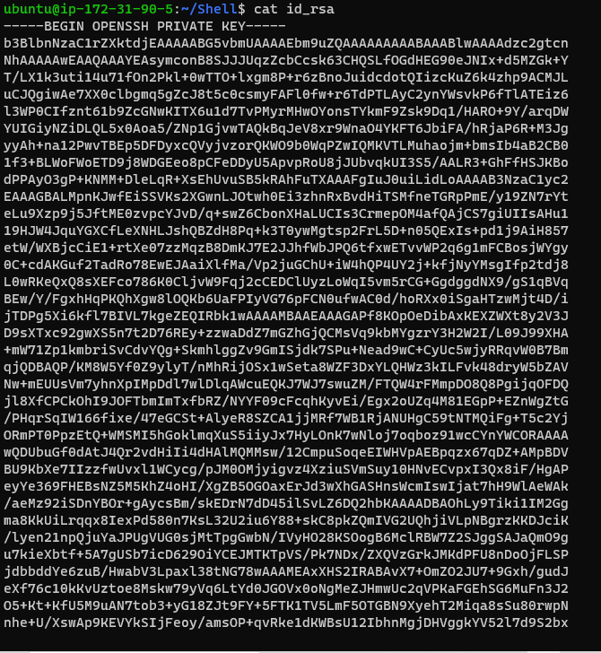
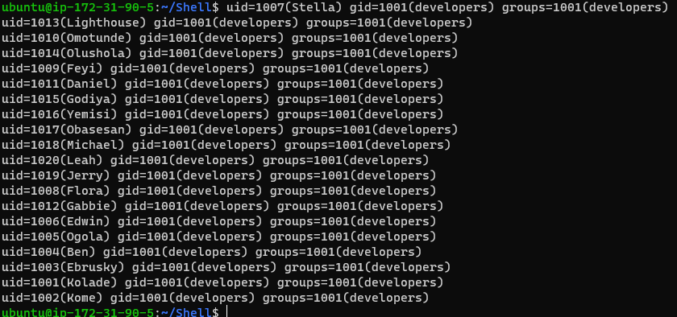
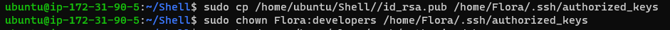
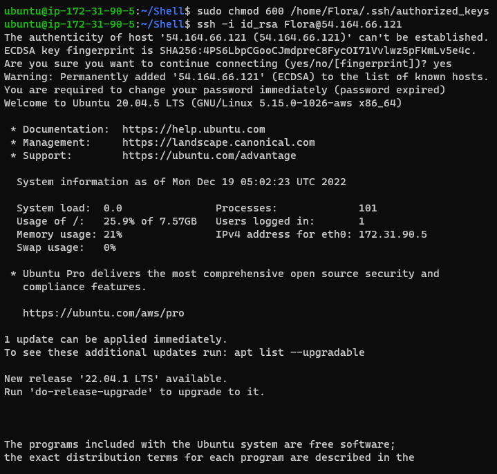
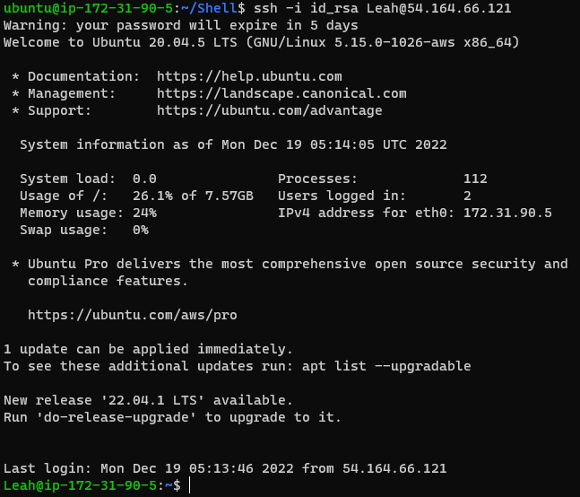

# Shell SCripting

## This project is aimed at onboarding 20 new users on a server.

I created a directory named **Shell**

Then, a file **names.csv** with the names of the 20 new users

 

Here is my **Shell Script**
 

I created a file for the public key
 

Then a file for the private key
 

I ran my script to read the names.csv file
 

To test a few users, I did the following;
- For the first user, *Flora* I copied the authorization key to the user folder and changed ownership
  

 - Changed access permission and connected to the server as *Flora*
 

- I also tried to connect to the server as *Leah*
 
 